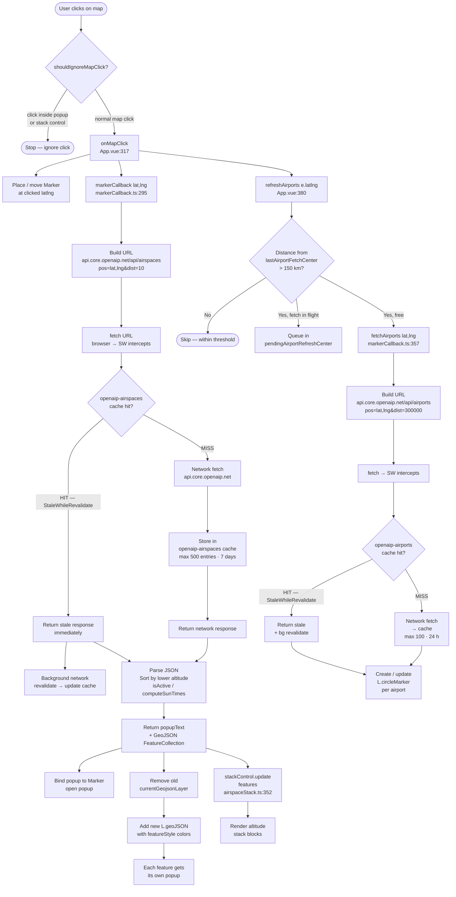
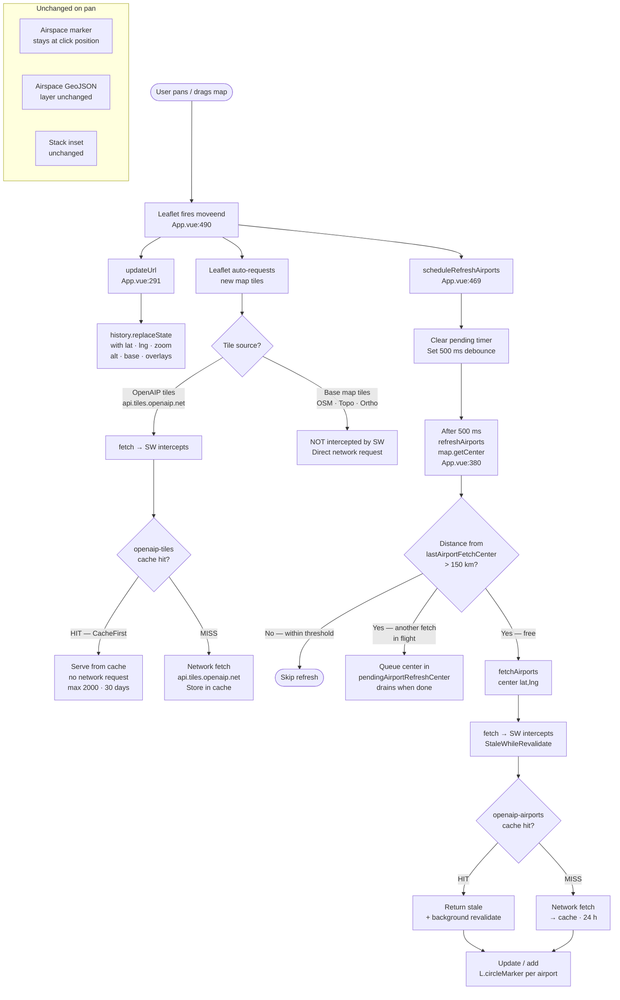
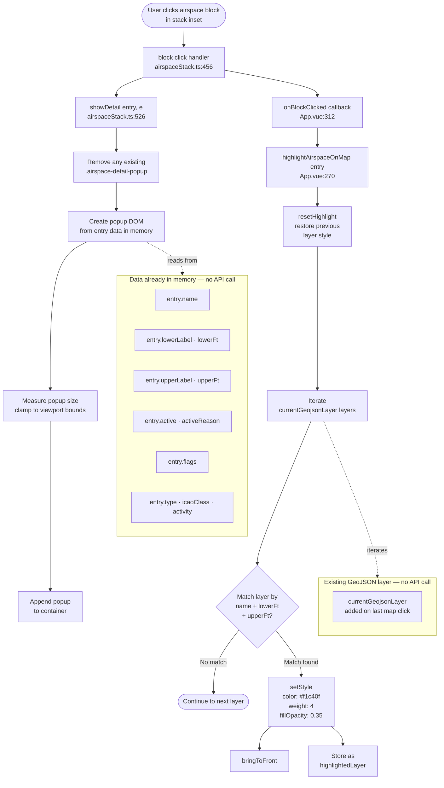

# Airspace Lookup — Information Flow Report

## Architecture Overview

The app is a single-page Vue 3 application built around Leaflet. All map logic lives in
`src/App.vue` (mounted once). Two helper modules handle domain logic:

| Module | Responsibility |
|---|---|
| [`src/markerCallback.ts`](../src/markerCallback.ts) | Airspace and airport API fetch, active-status computation |
| [`src/airspaceStack.ts`](../src/airspaceStack.ts) | `AirspaceStackControl` — the altitude-stack inset (Leaflet custom control) |
| [`src/sw.ts`](../src/sw.ts) | Service worker: Workbox cache strategies for all OpenAIP traffic |

### Service Worker Cache Strategies

All API requests pass through the service worker (registered via `vite-plugin-pwa`,
`injectManifest` mode). The API key is stripped from every cache key so it never
appears in Cache Storage and survives key rotation.

| Cache name | Route match | Strategy | Max entries | TTL |
|---|---|---|---|---|
| `openaip-airspaces` | `api.core.openaip.net/api/airspaces*` | StaleWhileRevalidate | 500 | 7 days |
| `openaip-airports` | `api.core.openaip.net/api/airports*` | StaleWhileRevalidate | 100 | 24 h |
| `openaip-tiles` | `api.tiles.openaip.net/*` | CacheFirst | 2 000 | 30 days |

Base map tiles (OSM, OpenTopoMap, basemap.at) are **not** registered SW routes —
they bypass the cache entirely.

---

## Scenario 1 — Click on Map

### Prose

When the user clicks the map, Leaflet fires a `click` event caught at
[`App.vue:483`](../src/App.vue#L483). A guard (`shouldIgnoreMapClick`) silently drops
any click whose DOM target is inside the existing popup, the stack control, or a
detail popup — preventing double-triggers from UI overlays.

Two async operations are launched:

**Airspace lookup (primary).** `onMapClick` places or moves a pin at the clicked
coordinate, then calls `markerCallback(lat, lng)`. That function builds a request to
`api.core.openaip.net/api/airspaces?pos={lat},{lng}&dist=10` and issues a `fetch`.
The service worker intercepts it and performs a *StaleWhileRevalidate* check:
if the URL (minus `apiKey`) is in `openaip-airspaces`, the cached response is
returned immediately and a background network request is queued to refresh it;
on a cache miss the network is hit directly and the response is stored before being
returned. The response is parsed, items sorted by lower altitude, and active status
computed from `hoursOfOperation` using `isActive()` / `computeSunTimes()`. The
function returns `{ popupText, geojson }`. `onMapClick` then opens the marker popup,
discards the old GeoJSON overlay, draws a new `L.geoJSON` layer with
aviation-standard colours from `featureStyle()`, and calls
`stackControl.update(features)` to refresh the altitude stack.

**Airport refresh (concurrent).** In parallel, `refreshAirports(e.latlng)` checks
whether the clicked point is more than 150 km from the last airport-fetch centroid.
If the threshold is exceeded and no other airport fetch is in flight, it calls
`fetchAirports(lat, lng)` against `api.core.openaip.net/api/airports?…&dist=300000`.
The SW applies the same StaleWhileRevalidate strategy on `openaip-airports`.
Returned airports are rendered as `L.circleMarker` objects (colour-coded by type)
and added to or updated in `airportMarkerById`.

### Flow Diagram

> Open in draw.io:  
> [Diagram 1 — Click on Map](https://app.diagrams.net/?grid=0&pv=0&border=10&edit=_blank#create=%7B%22type%22%3A%22mermaid%22%2C%22compressed%22%3Atrue%2C%22data%22%3A%22pVbRcuI4EPwaV909hAITluTRGEjIAclictncm5AF1iEslyyH5e93Rja2jM3m9pZKQLaZnp7RqJutkEcaEaUdt7seO10PPss%2F7w9nMHpNmYI1FZzuU1jIGN4OJHEG4z9hdXPj9CfwOXKGozSSmQhnu1gqtiCJjyFOf%2BoML4FHZeDQN8BwzeOUhwwWiUwyQPcBBa5STcxjKmOtpIAAuPCRWKBlgnAT17nrOve3iGFSn9kahtcTw1cPRBTFnEMM%2FBjQZVxWAFS8JOl8ZMzpe%2F3eEHARto48tnoxgfgXQSgzj6aYQn7gxYKoPXQTAIk%2Bp2QhrATRIt4VwFdQp4B6MAA%2BEWKTt0UgkG9i%2Fbj%2BtKNT4OveD1r5Ti3kB0AeZVwgk9fV3PBLeIdCLzsyYTHhSSdmkGgKt%2FGdqzSB8lL8ZiIhzbji4X4JearhVq%2FbrOfByvoIWbdM06jKulHymI%2Bb2dUvzr0L6%2BDNjIdmirIEimor59ECnsEoFrRvalQpoRFuQ8R161jOrOl4nK0vhivQRLC3iAu2Yh9E8JBols%2FLE1SyYjpTcT6wApMoliYyThkm5ocDCzl8X5yaPXmyqP%2BFOwF7t1Myi3E7oO1HqcwMqiprvT9ZUtzM62sksMtazIIgJw0NHy0LdLebb8S1jW9Azi3Oi%2FwsmnPHY3NwG80vueGQfofLQRdhGJxpbh47vuuMhrDA%2F5Cc0mbOhZVzaXc8Lquoet4yInafn%2FGEEpUi56fgeYnEAmlUcHPCYyWPZgyJ0FxnYb6JqUc1%2F6gONZWHJNMsyOI1P7AWxstaxgahZ%2Bvxi12QUcA1%2B64xreOiaD0waXjCwWUEvsZ8KQQDPiDHbcW%2BWNhfcai4GadcW92uljU1wg0rnzbKsLFWhmchZxIUA49VphTsJFD8N5XxnJwQ9BJkZYEEAOKF%2BXgfcZo6u6I8QDtyHZmBNGUG%2BmROE5VCqpYWBxbsGmAnhFrRsNoxbc4%2B18a8jv%2BxzlfAMtbj577TKQ4ZIBXYBvU84YEuBbc%2FcJvQrxb036aFcdgYsLPVbYREq%2F3MZd4AR7EtMIk8rhKYXqyQdc5eUnOtuxYxfrPAvoFmjkG3SWxca6vkAREESXUBPkWF8BnKsBlLE9YbIND%2B0Cqn3yzdWcpcdd6Nc%2B%2F5pXPjrnPcGx1hQWayGu5tA76jbPjOWbmM9MCF4LtI56n%2BgUxfM5ZVugRTHvJ4VxS0ynt3Luln7KtkihWa73ln%2B7Ka%2F6kb9wfDZibPszbCG%2F26Gefpf%2BbF%2FS6%2BWlKP7NS%2B5cifG7AN49sw47r%2Fluw%2Bs19v7Pw%2F%2F%2FUmTQMulXMDbeha3tkkb6et%2FNGbthuk3ZgLU%2BsZUyutzEXWUUvCid0t%2FPHlK1bYujGWSmvmHcoVFayS6iSXjbytLdjTOnZDQdJCUM00cyFgKB23v91SeMHUpCB2e5bfpNQMTXv8%2B2%2FGP9Xiw1sWhuQi3r0jw9vBlXjTxN8BmF8UsO3T8CIequrBD5IrBKa%2FAPAD%22%7D)

### Key Code Locations

| Step | File | Line |
|---|---|---|
| Map click event handler | [`App.vue`](../src/App.vue#L483) | 483 |
| Click guard | [`App.vue`](../src/App.vue#L477) | 477–481 |
| `onMapClick` orchestrator | [`App.vue`](../src/App.vue#L317) | 317–363 |
| `markerCallback` (airspace fetch) | [`markerCallback.ts`](../src/markerCallback.ts#L295) | 295–355 |
| Active-status computation | [`markerCallback.ts`](../src/markerCallback.ts#L256) | 256–281 |
| `stackControl.update` | [`airspaceStack.ts`](../src/airspaceStack.ts#L352) | 352–380 |
| `refreshAirports` | [`App.vue`](../src/App.vue#L380) | 380–466 |
| `fetchAirports` | [`markerCallback.ts`](../src/markerCallback.ts#L357) | 357–368 |
| SW airspace cache rule | [`sw.ts`](../src/sw.ts#L30) | 30–40 |
| SW airport cache rule | [`sw.ts`](../src/sw.ts#L43) | 43–53 |

---

## Scenario 2 — Pan the Map

### Prose

Panning does **not** trigger an airspace re-query. The only effects are a URL sync,
a debounced airport refresh, and automatic tile loading.

When the viewport settles after a pan (or zoom), Leaflet fires `moveend` at
[`App.vue:490`](../src/App.vue#L490). Two things happen synchronously:

1. `updateUrl()` calls `history.replaceState` to encode the new map centre,
   zoom level, active altitude, selected base layer, and overlay keys into the URL.
2. `scheduleRefreshAirports()` resets a 500 ms debounce timer. While the user is
   still dragging, repeated `moveend` events keep resetting the timer. Only after
   the map comes to rest does the actual `refreshAirports(map.getCenter())` fire.

The airport-fetch pipeline applies the same 150 km threshold check and
in-flight-queue logic as in Scenario 1. If the new map centre is within 150 km of
the last fetch centroid, the fetch is skipped.

Tile loading is fully implicit — Leaflet issues `fetch` requests for every tile grid
square that enters the viewport. The SW intercepts OpenAIP tile requests and applies
a *CacheFirst* strategy from `openaip-tiles`: a cached tile (max 2 000 entries,
30-day TTL) is returned instantly without touching the network; missing tiles are
fetched from `api.tiles.openaip.net` and stored in the cache. Base map tiles
(OSM, OpenTopoMap, Austria Orthophoto) are not registered SW routes and go directly
to the network.

The airspace marker, GeoJSON overlay, and stack inset are all untouched by a pan.

### Flow Diagram

> Open in draw.io:  
> [Diagram 2 — Pan the Map](https://app.diagrams.net/?grid=0&pv=0&border=10&edit=_blank#create=%7B%22type%22%3A%22mermaid%22%2C%22compressed%22%3Atrue%2C%22data%22%3A%22pVZdU%2BJKEP01qdr7IBWDLPIIARRXQA3o3fs2Jh0yxZDJnUxk2V%2B%2F3ZMYBgK6VSoFmSR9%2BvTXmYmF3IYJU9rx3MXQcfv4W3%2F635zOYJmDwuuMpbm5O8bvSLEVrTYsczrDf%2FDq4sJpj%2FB3gBb3wGIBhBhzBeY9%2BQaQRk7HT%2FtZ1norwGn3r3ouGpPLQ68DC85HuCKLmIalEofmXu%2ByMrdsfct2iLYJz7VUu5aCTLAQAo1IBLPlOsFXBCOWju85gy4t05W9%2FC3lhl5m4uCtV5aDvcbYlGC7%2FNNgRkgoDxOICgFPEGNqkj5XmVQ6P8rM914ztJGFNEYkXwAzhcHEckNc8w2WCpECk%2FyOS2Ybyn8Er7JIQ%2FiU4s1B%2BVih5YWC%2FwvIS4opbKuqkzcBp2O%2BsQBvne5ggW%2FiZS4LhRTaY6d7HNttbdH15xhQf%2FKw94AFyHjLLFoSHzKetVLk16ViT5BwDDqkajojz7n%2B7vQ8vA5e8IunGtBlpvNmOicWyTskWSFf1E5DhqXChwnXJznfWZxvJ4t3%2F67Tu6JGJOsxV3nF8wfyDEC9EWKssK88t3RAWZW4woi2Uq3xqko4PdmwX3jDc00l64Zr0yrad9wZUtNJEJTO79H5rMYv03U2rdQ%2FODNg8reneaLOdtUG5VActIafzoOpTXwhM2mv50onsqQ4JYrzhV00iGjYdmUxEWyIYhLq06k6wW5sFXiG6P1YGyGrxwIhVXMKMYLWCrQPRONwLNvXpwVrZnmaYysNUXQYTVtVagQRLNeVlzGlfw9fml12CGi9OdlpcyvPM3nUaKRkpk46oVCkiMqEPpB2B2uemTSZMI1Un4f%2BaaTaxmap1IlJWt0zxlUs%2BCqpGvsR3TwWUFC0YRmVaRx8t1KmKu5K8faR4ybCzZ6yTYBQI5lCs6M%2FZoiQUPJ4ehcCu5g1ISP0Pul7w8GTVb3gb9WEZoQJeEk4SfkbEzwyO8sxeGCBLyyVYTbJT4RmcSQ0JtwlMn0CXSjKXE5cTDN5JOavLFyvFAp%2BZGp%2Fnp2NvFeL59NqYefjnXI9yR4VI2l6WFrxv9Bhwuzlzvs5gkXmTHDfCrkKBUyZWpeHDfNdJamJ%2BnyA2pjHvHhdKZZREZcz%2F7Y%2FuxkN6Qm6T%2FGsk66MskjKHJ5qmvD2519SDpTxjIWlvhmGyBlzvqNuNCeIUPCQkpXJnGsuP8H8eYh5A%2FIumM9KmdiZyIua54dA%2F9GIa2Zc4yiV4v2BLR3BmtnSO7M9%2F6BicyFQ6ByvHV1BFDGcmVwruYbypnfNuledM%2FbLL9o%2FHNjHcYh%2FR%2FZh6NJWeNp%2BemQft8PoyB5BL93uGfv7L9o%2Ff9HeblULx6X%2FI5xer4d3QimkKm90OpTVPw%3D%3D%22%7D)

### Key Code Locations

| Step | File | Line |
|---|---|---|
| `moveend` handler | [`App.vue`](../src/App.vue#L490) | 490 |
| `updateUrl` | [`App.vue`](../src/App.vue#L291) | 291–309 |
| `scheduleRefreshAirports` | [`App.vue`](../src/App.vue#L469) | 469–475 |
| `refreshAirports` (debounced) | [`App.vue`](../src/App.vue#L380) | 380–466 |
| SW tile cache rule (CacheFirst) | [`sw.ts`](../src/sw.ts#L57) | 57–67 |

---

## Scenario 3 — Click on Airspace in Stack Inset

### Prose

Clicking a block in the stack inset performs two purely local operations — no network
request is made.

The `AirspaceStackControl` renders one `div.airspace-block` per airspace entry
([`airspaceStack.ts:444`](../src/airspaceStack.ts#L444)). Each block has a `click`
listener that fires `showDetail(entry, e)` and then the `onBlockClicked` callback.

**Detail popup.** `showDetail` creates a floating `.airspace-detail-popup` DOM element
from the `AirspaceEntry` already held in memory (populated by the last
`stackControl.update()` call). It measures the popup's rendered size, clamps its
position so it stays within the viewport, and appends it to the control container.
No API call is needed — all data (name, class, type, altitude limits, active status,
flags) is already present in the `entry` object.

**Map highlight.** The `onBlockClicked` callback wired in `App.vue:312` calls
`highlightAirspaceOnMap(entry)`. This iterates the layers of `currentGeojsonLayer`
(the GeoJSON drawn on the last map click) and matches the entry by
`name + lowerFt + upperFt`. The matched `L.Path` receives a highlight style
(`#f1c40f` border, weight 4, fillOpacity 0.35) and is brought to front. The
previously highlighted layer is restored to its original computed style via
`resetHighlight()`. Again, no network request is made — the GeoJSON layer data is
already on the map.

### Flow Diagram

> Open in draw.io:  
> [Diagram 3 — Click on Airspace in Stack Inset](https://app.diagrams.net/?grid=0&pv=0&border=10&edit=_blank#create=%7B%22type%22%3A%22mermaid%22%2C%22compressed%22%3Atrue%2C%22data%22%3A%22nZXbctowEIafxjPtBYyxcUguwRySFEICSTu9lG0Z1AjJI8lJ6NN3V8aOiAntdDBYXuRPq91%2FVzmXr%2BmWKOMF%2FuPY84dwb67hFy8aPWmqYJxylj5rGBCmdEFSCsOEy%2FTZi2LBBDxpQ%2BAp8JnQ1HjR%2BCuMOx0vnMB9BKBq9oEE9y0RGQc2vF8z14joGu2Fw350AQx06NinkUONgaq38nVMDWEcDFQYtfeCGIefcKOg5n4CHQNUihE6G6OnNEOfCecJqTY7LIruS0mBFfaCkz7GDm4CuBXdyRcMGBF7dO2NacPEBmHd2sVOZjfRKWRRFm0PJw5yCshYUWIQWc0Ht5cL5OVK7t4D4WfEEJsS%2BNmBF2BsoacOegboBSW6VC5bs982nCknO3w2En5eGH0tpBVOIkuR6TZ55pCvgQyRoyJrwEC0pFQK2LpAKZwIpi6TjSLFFoaLyWK5%2BonmaDSudkY4BCLbf9gjzJgE3qXvXfVhLHCR4f3NIY9tP93rBtg2el1BdvT83NtmLlQRVXOSUFShFwfeaAADa52a85BvDaSE8LQh1vo3yLyBkNQwq7UGUFlWkFUpzlMWDSXnZHMioe5110w2%2B%2BJoQZYSGXOidcsLZk7oDyXRyroVZddqZ4BazxBmxT2I35XQem3sKG4JDm7ZZsvha4aHMluKBSmaAjmq5mDgt51bOsB7ACoKze26piIALEZW5aLoC5OlRisne9s2tdnzEyq6d7APgL0xVGE9Y5GVSoF3Myp%2FQcLmB47lncjIgwNaeYPRgph0W8%2FH0rSbtFLG%2BSNXlbGoDLXCwqk3%2BMhfNfxBfId1tLML2CSs8XiIoXiZKBFvi1nQN9Osj4fA57za1xzbR4V8xI5OzbqKGgRDcqkgN%2FblMO%2BlfT9H%2Byu14bd%2F9G3fY5wvIcGoMGv1u2HUDtejE64nPJMU9OFHOVWwi%2FOzv8Ps9SHRxKa40RbN5ofdnu1es8nydr2882z7mtRnANipPNjrpP138%2FoB5FP6waMwy%2BxJJoVdSBubSyyF6jz%2Bt7J8cMuSVaLVVerq7bVDYJPpdG%2FMlU1SSC%2FziF7Bga2Nks%2B0MoaXlzRMwfie%2FLCXRBRgp8HvgXXIYR7k2QdyL7qIUv%2BY7Gf9Ael9Ql4fMfMIPx%2BYSZLAy38A%22%7D)

### Key Code Locations

| Step | File | Line |
|---|---|---|
| Block click listener | [`airspaceStack.ts`](../src/airspaceStack.ts#L456) | 456–460 |
| `showDetail` (popup creation) | [`airspaceStack.ts`](../src/airspaceStack.ts#L526) | 526–573 |
| `onBlockClicked` wiring | [`App.vue`](../src/App.vue#L312) | 312–313 |
| `highlightAirspaceOnMap` | [`App.vue`](../src/App.vue#L270) | 270–289 |
| `resetHighlight` | [`App.vue`](../src/App.vue#L262) | 262–268 |
| `renderBlocks` (block creation) | [`airspaceStack.ts`](../src/airspaceStack.ts#L404) | 404–466 |

---

## Summary Comparison

| | Click on Map | Pan the Map | Click on Stack Inset |
|---|:---:|:---:|:---:|
| Airspace API call | Yes | No | No |
| Airport API call | Yes (if >150 km from last fetch) | Yes (debounced, if >150 km) | No |
| Tile fetches | No | Yes (auto by Leaflet) | No |
| SW cache consulted | Airspaces + airports | Tiles + airports | None |
| GeoJSON layer updated | Yes | No | No (read-only) |
| Stack inset updated | Yes | No | No (read-only) |
| Map highlight updated | No | No | Yes |
| URL updated | No¹ | Yes | No |

¹ URL is not updated on click — only on `moveend` and control changes.
